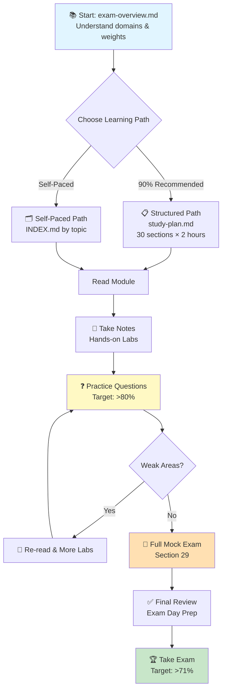

# GitHub Actions GH-200 Certification Study Materials

> Comprehensive study guide for the GitHub Actions (GH-200) certification exam with 25,000+ lines of detailed content, practice questions, and hands-on labs.

- [GitHub Actions GH-200 Certification Study Materials](#github-actions-gh-200-certification-study-materials)
  - [📋 Overview](#-overview)
    - [What's Included](#whats-included)
  - [🎯 Quick Start](#-quick-start)
    - [For New Learners](#for-new-learners)
    - [For Experienced Developers](#for-experienced-developers)
    - [For Quick Reference](#for-quick-reference)
  - [📚 Study Materials](#-study-materials)
    - [Core Topics (19 Modules)](#core-topics-19-modules)
      - [Fundamentals (Sections 1–4)](#fundamentals-sections-14)
      - [Workflow Configuration (Sections 5–8)](#workflow-configuration-sections-58)
      - [Workflow Features (Sections 9–13)](#workflow-features-sections-913)
      - [Advanced Topics (Sections 14–19)](#advanced-topics-sections-1419)
    - [Navigation \& Reference](#navigation--reference)
  - [🗓️ Study Plans](#️-study-plans)
    - [60-Hour Structured Plan](#60-hour-structured-plan)
    - [Self-Paced Alternative](#self-paced-alternative)
  - [🧪 Practice Questions](#-practice-questions)
    - [Question Generation](#question-generation)
    - [Practice Quiz Resources](#practice-quiz-resources)
  - [📊 Exam Information](#-exam-information)
    - [GH-200 Domains \& Weights](#gh-200-domains--weights)
    - [Exam Format](#exam-format)
  - [🛠️ Hands-On Labs](#️-hands-on-labs)
    - [Workflow Authoring Labs](#workflow-authoring-labs)
    - [Action Development Labs](#action-development-labs)
    - [Security \& Optimization Labs](#security--optimization-labs)
    - [Troubleshooting Labs](#troubleshooting-labs)
  - [📖 How to Use This Repository](#-how-to-use-this-repository)
    - [Study Flow](#study-flow)
    - [During Study](#during-study)
    - [Before Exam](#before-exam)
  - [📈 Expected Outcomes](#-expected-outcomes)
    - [With This Material](#with-this-material)
  - [🔗 External Resources](#-external-resources)
    - [Official References](#official-references)
    - [Recommended Tools](#recommended-tools)
  - [💡 Tips for Success](#-tips-for-success)
    - [Study Mindset](#study-mindset)
    - [Question Strategy](#question-strategy)
    - [Time Management](#time-management)
    - [Common Pitfalls to Avoid](#common-pitfalls-to-avoid)
  - [📝 File Directory](#-file-directory)
  - [🤝 Contributing](#-contributing)
  - [📞 Support](#-support)
  - [✅ Ready to Start?](#-ready-to-start)


## 📋 Overview

This repository contains production-grade study materials designed to help you achieve **>71% on the GH-200 certification exam**. The materials cover all five exam domains with realistic scenarios, practical exercises, and question generators.

### What's Included

- **19 comprehensive topic modules** covering all GH-200 exam objectives
- **25,000+ lines** of detailed technical content
- **100-question practice exam generator** with multiple difficulty levels
- **60-hour structured study plan** broken into manageable 2-hour sections
- **Hands-on labs** for each major topic area
- **VS Code integration** guides and tooling documentation

## 🎯 Quick Start

### For New Learners

1. Start with [60-hour-study-plan.md](60-hour-study-plan.md) for a structured 60-hour curriculum
2. Follow the recommended pace (10–30 days depending on intensity)
3. Use the practice questions to validate knowledge
4. Work through hands-on labs as you progress

### For Experienced Developers

1. Review [exam-overview.md](exam-overview.md) for exam objectives
2. Skim topics you're familiar with (use INDEX.md for navigation)
3. Deep-dive into weak areas (security, enterprise features)
4. Complete 2–3 practice question sets before exam day

### For Quick Reference

- **Need to debug a workflow?** → [12-Workflow-Debugging.md](12-Workflow-Debugging.md)
- **Forgot context syntax?** → [02-Contextual-Information.md](02-Contextual-Information.md) or [03-Context-Availability-Reference.md](03-Context-Availability-Reference.md)
- **Setting up runners?** → [16-Managing-Runners.md](16-Managing-Runners.md)
- **Security questions?** → [18-Security-and-Optimization.md](18-Security-and-Optimization.md)

---

## 📚 Study Materials

### Core Topics (19 Modules)

#### Fundamentals (Sections 1–4)

- [01-GitHub-Actions-VS-Code-Extension.md](01-GitHub-Actions-VS-Code-Extension.md) — Tooling and local development
- [02-Contextual-Information.md](02-Contextual-Information.md) — GitHub contexts (github, env, secrets, job, runner, etc.)
- [03-Context-Availability-Reference.md](03-Context-Availability-Reference.md) — Context scope and availability matrix
- [04-Workflow-File-Structure.md](04-Workflow-File-Structure.md) — YAML structure, jobs, steps, strategy, services

#### Workflow Configuration (Sections 5–8)

- [05-Workflow-Trigger-Events.md](05-Workflow-Trigger-Events.md) — Triggers, webhooks, scheduling, workflow_dispatch
- [06-Custom-Environment-Variables.md](06-Custom-Environment-Variables.md) — Setting and scoping variables
- [07-Default-Environment-Variables.md](07-Default-Environment-Variables.md) — GitHub-provided variables reference
- [08-Environment-Protection-Rules.md](08-Environment-Protection-Rules.md) — Deployments, approvals, permissions

#### Workflow Features (Sections 9–13)

- [09-Workflow-Artifacts.md](09-Workflow-Artifacts.md) — Upload, download, retention, REST APIs
- [10-Workflow-Caching.md](10-Workflow-Caching.md) — Cache strategies, keys, performance
- [11-Workflow-Sharing.md](11-Workflow-Sharing.md) — Reusable workflows, workflow_call, versioning
- [12-Workflow-Debugging.md](12-Workflow-Debugging.md) — Debug logging, logs, run history
- [13-Workflows-REST-API.md](13-Workflows-REST-API.md) — Query, manage, and automate workflows

#### Advanced Topics (Sections 14–19)

- [14-Reviewing-Deployments.md](14-Reviewing-Deployments.md) — Deployment gates, approvals, status
- [15-Creating-Publishing-Actions.md](15-Creating-Publishing-Actions.md) — Custom actions, marketplace, versioning
- [16-Managing-Runners.md](16-Managing-Runners.md) — GitHub-hosted, self-hosted, runner groups
- [17-GitHub-Actions-Enterprise.md](17-GitHub-Actions-Enterprise.md) — Policies, templates, governance
- [18-Security-and-Optimization.md](18-Security-and-Optimization.md) — Secrets, OIDC, action pinning, performance
- [19-Common-Failures-Troubleshooting.md](19-Common-Failures-Troubleshooting.md) — Diagnostics, error patterns, solutions

### Navigation & Reference

- [INDEX.md](INDEX.md) — Complete topic index with quick navigation paths
- [GitHub-Workflows-Guide.md](GitHub-Workflows-Guide.md) — High-level overview and relationships
- [exam-overview.md](exam-overview.md) — Official exam domains and skill breakdown

---

## 🗓️ Study Plans

### 60-Hour Structured Plan

**Duration:** 10–30 days | **Sections:** 30 × 2-hour modules

Follow [study-plan.md](study-plan.md) for a complete curriculum with:

- Week-by-week breakdown
- Learning objectives per section
- Hands-on deliverables
- Progress tracking templates

**Recommended Paces:**

- **Intensive (10 days):** 3 sections/day, 6 hours/day study
- **Balanced (20 days):** 1.5 sections/day, 3 hours/day study
- **Relaxed (30 days):** 1 section/day, 2 hours/day study

### Self-Paced Alternative

Pick topics based on exam objectives or your weak areas. Use the INDEX.md for navigation by topic or learning goal.

---

## 🧪 Practice Questions

### Question Generation

The `question-prompt.md` file generates **100 high-quality certification exam questions** per run.

**Question Distribution:**

- **Difficulty:** 20% Easy | 60% Medium | 20% Hard
- **Answer Types:** 55% single-choice | 26% multiple-choice | 12% all-correct | 7% none-correct
- **Coverage:** 19 topics | 5 exam domains | Security minimum | Enterprise minimum

**How to Generate:**

1. Open `question-prompt.md`
2. Follow the prompt instructions
3. Generate questions (iterate for different sets)
4. Save output to `quiz/gh-200-iteration-[N].md`

### Practice Quiz Resources

- `question-prompt.md` — Generator prompt with parameters
- `question-prompt-reference.md` — Question taxonomy and patterns
- `question-prompt-examples.md` — Sample questions for each domain
- `quiz/` directory — Generated question sets

---

## 📊 Exam Information

### GH-200 Domains & Weights

| Domain | Weight | Coverage |
|--------|--------|----------|
| **Author and manage workflows** | 20–25% | Triggers, jobs, matrix, contexts, expressions |
| **Consume and troubleshoot workflows** | 15–20% | Debugging, logs, templates, artifacts |
| **Author and maintain actions** | 15–20% | Custom actions, marketplace, distribution |
| **Manage GitHub Actions for enterprise** | 20–25% | Runners, policies, templates, governance |
| **Secure and optimize automation** | 10–15% | Secrets, OIDC, pinning, performance |

### Exam Format

- **Duration:** 120 minutes (2 hours)
- **Questions:** ~100 multiple-choice
- **Passing Score:** 71%
- **Question Types:** Scenario-based, troubleshooting, best practices
- **Format:** Single-choice, multiple-choice, all-correct, none-correct

---

## 🛠️ Hands-On Labs

Each study plan section includes practical exercises:

### Workflow Authoring Labs

- Build workflows with multiple triggers
- Implement conditional logic and matrix strategies
- Create reusable workflows with workflow_call
- Set up service containers and testing

### Action Development Labs

- Create composite actions
- Build JavaScript actions with inputs/outputs
- Publish actions to marketplace
- Implement versioning strategies

### Security & Optimization Labs

- Implement least-privilege permissions
- Set up artifact attestation
- Configure caching for performance
- Establish enterprise governance

### Troubleshooting Labs

- Diagnose matrix job failures
- Debug timeout and resource issues
- Analyze logs for common patterns
- Fix cross-platform compatibility issues

---

## 📖 How to Use This Repository

### Study Flow



### During Study

- **Active Reading:** Take notes, ask "why" questions
- **Hands-On Work:** Build actual workflows, not theoretical
- **Practice Testing:** Complete question sets weekly
- **Spaced Repetition:** Review topics 1 day, 3 days, 1 week later
- **Explain Concepts:** Teach others to solidify understanding

### Before Exam

- Complete 2–3 full mock exams
- Achieve >80% on practice questions
- Review weak areas identified during practice
- Understand common exam tricks and pitfalls
- Prepare logistics: calculator, notepad, testing environment setup

---

## 📈 Expected Outcomes

### With This Material

| Study Duration | Expected Score | Confidence |
|--------|---------|------------|
| 30 hours focused | 71–75% | Passing |
| 45 hours structured | 76–82% | Comfortable |
| 60 hours (full plan) | 82–90% | Strong |
| 80+ hours (with labs) | 90%+ | Expert |

**Note:** Results depend on prior GitHub Actions experience, learning style, and practice quality.

---

## 🔗 External Resources

### Official References

- [GitHub Actions Documentation](https://docs.github.com/en/actions)
- [GitHub Actions Marketplace](https://github.com/marketplace?type=actions)
- [GH-200 Exam Details](https://github.blog/news-and-updates/product-news/github-certification/)

### Recommended Tools

- [GitHub Actions Marketplace](https://github.com/marketplace?type=actions) — Find vetted actions
- [GitHub CLI](https://cli.github.com/) — Manage workflows from command line
- [Act](https://github.com/nektos/act) — Run workflows locally
- VS Code GitHub Actions Extension — Local validation and IntelliSense

---

## 💡 Tips for Success

### Study Mindset

- Focus on **WHY** workflows are designed certain ways, not just memorizing syntax
- Practice with real scenarios, not just theoretical examples
- Learn from failures—debug intentionally-broken workflows
- Connect concepts to your own GitHub projects

### Question Strategy

- Read questions carefully; 15% of errors are due to misreading
- Eliminate obviously wrong answers first
- Watch for absolute language ("always," "never")
- Scenario questions reward practical experience

### Time Management

- Allocate 1–2 minutes per question on the real exam
- Review difficult questions to verify logic
- Don't second-guess yourself excessively
- Flag unclear questions and return if time permits

### Common Pitfalls to Avoid

- ❌ Memorizing syntax without understanding concepts
- ❌ Skipping security and enterprise topics
- ❌ Not practicing with the VS Code extension
- ❌ Confusing GITHUB_TOKEN permissions with PAT
- ❌ Overlooking context availability scoping rules

---

## 📝 File Directory

```shell
github-actions/
├── README.md (this file)
├── study-plan.md                           # 60-hour structured curriculum
├── exam-overview.md                        # Exam domains and skills
├── INDEX.md                                # Topic navigation index
├── GitHub-Workflows-Guide.md               # Overview and relationships
│
├── 01-GitHub-Actions-VS-Code-Extension.md
├── 02-Contextual-Information.md
├── 03-Context-Availability-Reference.md
├── 04-Workflow-File-Structure.md
├── 05-Workflow-Trigger-Events.md
├── 06-Custom-Environment-Variables.md
├── 07-Default-Environment-Variables.md
├── 08-Environment-Protection-Rules.md
├── 09-Workflow-Artifacts.md
├── 10-Workflow-Caching.md
├── 11-Workflow-Sharing.md
├── 12-Workflow-Debugging.md
├── 13-Workflows-REST-API.md
├── 14-Reviewing-Deployments.md
├── 15-Creating-Publishing-Actions.md
├── 16-Managing-Runners.md
├── 17-GitHub-Actions-Enterprise.md
├── 18-Security-and-Optimization.md
├── 19-Common-Failures-Troubleshooting.md
│
├── question-prompt.md                      # Generate 100 practice questions
├── question-prompt-reference.md            # Question taxonomy
├── question-prompt-examples.md             # Sample questions
│
└── quiz/                                   # Generated question sets
    └── gh-200-iteration-[N].md
```

---

## 🤝 Contributing

Found an error or have a suggestion? Please:

1. Open an issue with details
2. Reference the specific topic file
3. Provide the correction or improvement
4. Include your GitHub Actions experience level

---

## 📞 Support

- **Questions about a topic?** Refer to the specific markdown file and exam-overview.md
- **Need clarification on concepts?** Review the related context files and hands-on labs
- **Practice question answer?** Check question-prompt-reference.md for patterns
- **Technical issues?** Verify your VS Code extension setup using 01-GitHub-Actions-VS-Code-Extension.md

---

## ✅ Ready to Start?

1. **New to certifications?** → Start with [study-plan.md](study-plan.md) Section 1
2. **Short on time?** → Pick topics from [INDEX.md](INDEX.md) by exam domain
3. **Want quick wins?** → Review [exam-overview.md](exam-overview.md) then tackle security/enterprise topics
4. **Ready to practice?** → Follow [study-plan.md](study-plan.md) Sections 28–29 for mock exams

---

**Good luck with your GH-200 certification! With focused study using these materials, you should comfortably exceed the 71% pass threshold.**

---

*Last Updated: March 22, 2026*
*Repository: pbaletkeman/github-actions*
*Branch: main*
