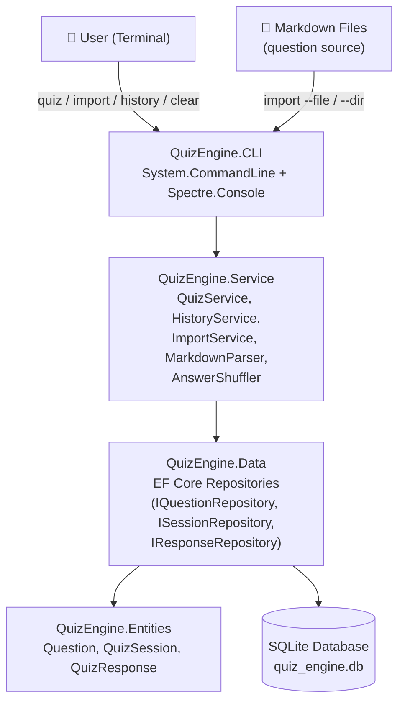
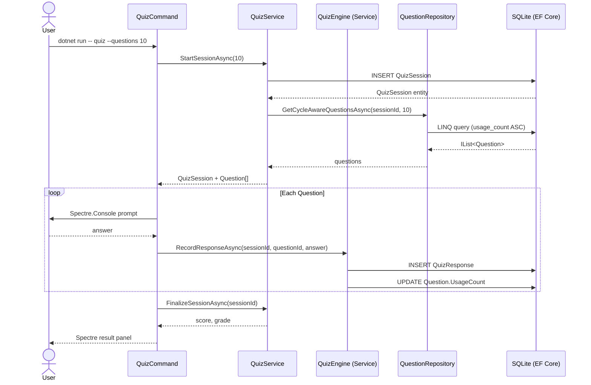
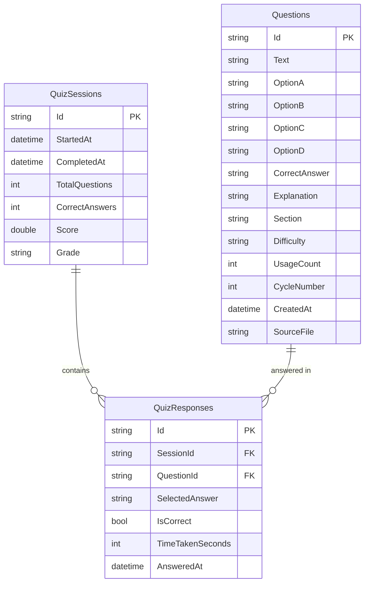
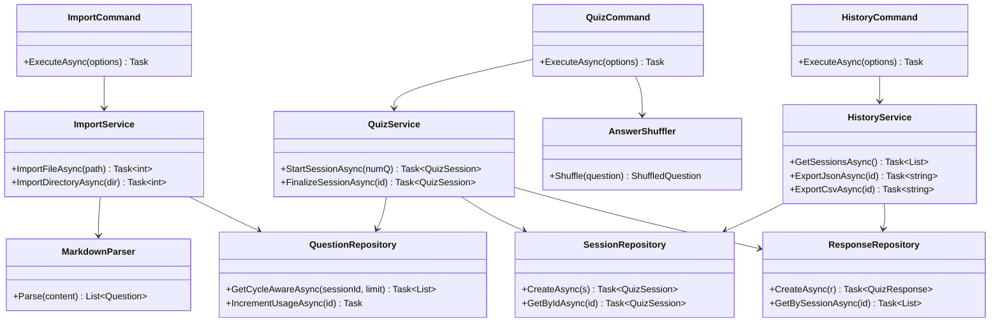

# Architecture — quiz-engine-csharp

> Part of the [Quiz Engine multi-language collection](../README.md)

---

## System Overview

### 1000 ft View

A high-level picture of the four-project .NET solution and its layers.

**Description:** Four-layer solution — CLI, Service, Data, Entities — with EF Core managing SQLite persistence.

---

## Sequence Diagram

### Taking a Quiz Session

The request flow from `quiz` command to displayed results.

**Description:** EF Core handles all persistence; Spectre.Console renders rich terminal output.

---

## ER Diagram

### Database Schema

Entity Framework Core entities mapped to SQLite tables.

**Description:** EF Core navigational properties map these three entities; IDs are GUIDs.

---

## Class Diagram

### Solution Class Structure

Key classes across the four .NET projects and their dependencies.

**Description:** CLI commands depend on service interfaces; repositories depend on `QuizEngineDbContext`.

---

## Data Flow Diagram

### Question Import and Quiz Flow

How data moves through the solution layers during import and quiz.

```mermaid
flowchart LR
    A["📄 Markdown File"] -->|"File.ReadAllText"| B["MarkdownParser\nParse()"]
    B -->|"IList<Question>"| C["ImportService\nImportFileAsync()"]
    C -->|"DbContext.Questions.AddRange"| D[("SQLite\nQuestions table")]

    D -->|"LINQ cycle-aware query"| E["QuestionRepository\nGetCycleAwareAsync()"]
    E -->|"List<Question>"| F["AnswerShuffler\nShuffle()"]
    F -->|"ShuffledQuestion"| G["QuizCommand\nSpectre prompt"]
    G -->|"user answer"| H["QuizService\nRecordResponseAsync()"]
    H -->|"INSERT QuizResponse"| I[("SQLite\nQuizResponses table")]
    H -->|"UPDATE UsageCount"| D
    I -->|"GROUP BY session"| J["QuizService\nFinalizeSessionAsync()"]
    J -->|"Score, Grade"| K["ConsoleFormatter\nRender result panel"]
```

**Description:** EF Core change-tracking handles batch inserts; Spectre.Console renders all terminal output.
