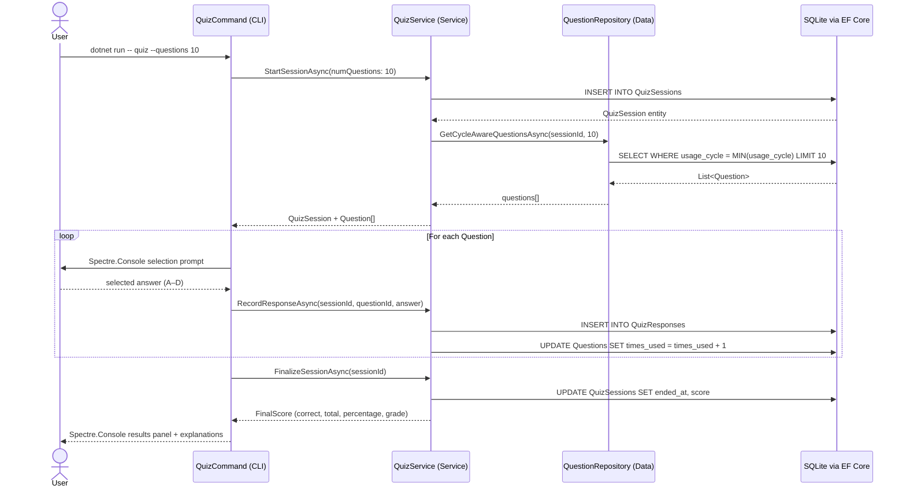
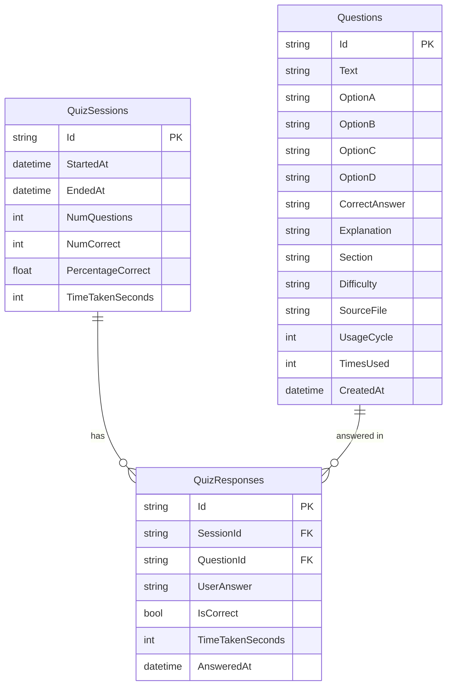
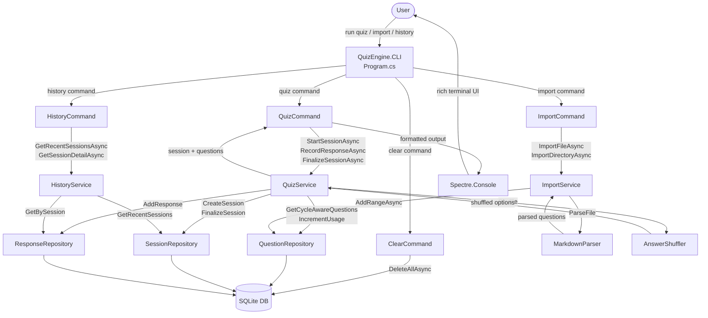

# Architecture — Quiz Engine C# / .NET 8

> Part of the [Quiz Engine multi-language collection](../../README.md)

- [Architecture — Quiz Engine C# / .NET 8](#architecture--quiz-engine-c--net-8)
  - [Sequence Diagram — Taking a Quiz Session](#sequence-diagram--taking-a-quiz-session)
  - [Class Diagram](#class-diagram)
  - [Entity Relationship Diagram](#entity-relationship-diagram)
  - [Data Flow Diagram](#data-flow-diagram)

---

## Sequence Diagram — Taking a Quiz Session

---

## Class Diagram

```mermaid
classDiagram
    class Question {
        +Guid Id
        +string Text
        +string OptionA
        +string OptionB
        +string OptionC
        +string OptionD
        +string CorrectAnswer
        +string Explanation
        +string Section
        +string Difficulty
        +string SourceFile
        +int UsageCycle
        +int TimesUsed
        +DateTime CreatedAt
    }

    class QuizSession {
        +Guid Id
        +DateTime StartedAt
        +DateTime? EndedAt
        +int NumQuestions
        +int NumCorrect
        +double PercentageCorrect
        +int TimeTakenSeconds
    }

    class QuizResponse {
        +Guid Id
        +Guid SessionId
        +Guid QuestionId
        +string UserAnswer
        +bool IsCorrect
        +int TimeTakenSeconds
        +DateTime AnsweredAt
    }

    class IQuestionRepository {
        <<interface>>
        +GetCycleAwareQuestionsAsync(id, n) List~Question~
        +GetByIdAsync(id) Question
        +AddRangeAsync(questions) void
        +DeleteAllAsync() void
    }

    class ISessionRepository {
        <<interface>>
        +CreateAsync(session) QuizSession
        +FinalizeAsync(id, score) void
        +GetRecentAsync(count) List~QuizSession~
        +GetByIdAsync(id) QuizSession
    }

    class IResponseRepository {
        <<interface>>
        +AddAsync(response) void
        +GetBySessionAsync(sessionId) List~QuizResponse~
    }

    class QuizService {
        -IQuestionRepository _questions
        -ISessionRepository _sessions
        -IResponseRepository _responses
        -AnswerShuffler _shuffler
        +StartSessionAsync(n) QuizSession
        +RecordResponseAsync(sessionId, qId, answer) void
        +FinalizeSessionAsync(sessionId) FinalScore
    }

    class ImportService {
        -IQuestionRepository _questions
        -MarkdownParser _parser
        +ImportFileAsync(path) int
        +ImportDirectoryAsync(dir) int
    }

    class HistoryService {
        -ISessionRepository _sessions
        -IResponseRepository _responses
        +GetRecentSessionsAsync(count, sort, order) List~QuizSession~
        +GetSessionDetailAsync(id) SessionDetail
    }

    class AnswerShuffler {
        +Shuffle(question) ShuffledQuestion
        +MapDisplayToOriginal(shuffled, letter) string
    }

    class MarkdownParser {
        +ParseSimpleFormat(text) List~Question~
        +ParseAnswerKeyFormat(text) List~Question~
        +ParseFile(path) List~Question~
    }

    QuizResponse --> QuizSession : sessionId FK
    QuizResponse --> Question : questionId FK
    QuizService --> IQuestionRepository
    QuizService --> ISessionRepository
    QuizService --> IResponseRepository
    QuizService --> AnswerShuffler
    ImportService --> IQuestionRepository
    ImportService --> MarkdownParser
    HistoryService --> ISessionRepository
    HistoryService --> IResponseRepository
    IQuestionRepository <|.. QuestionRepository
    ISessionRepository <|.. SessionRepository
    IResponseRepository <|.. ResponseRepository
```

---

## Entity Relationship Diagram

---

## Data Flow Diagram

