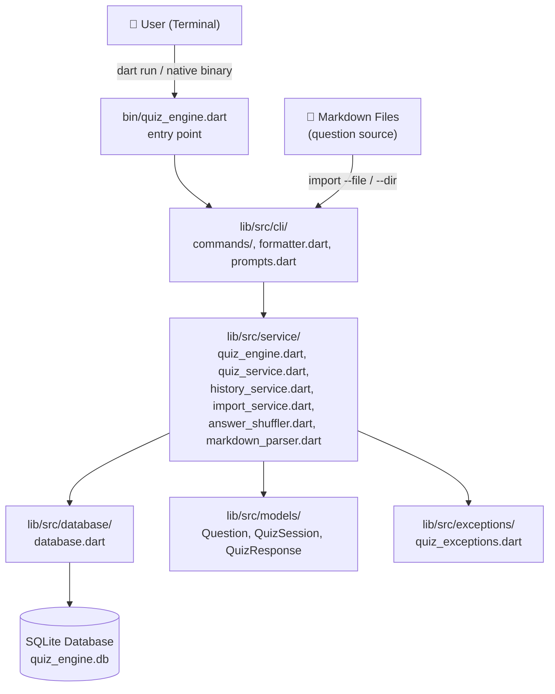
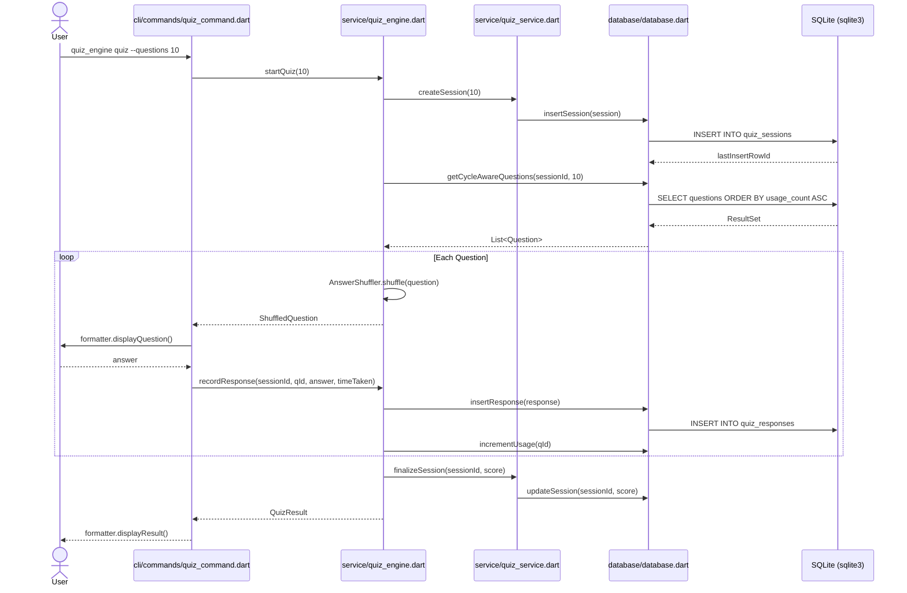
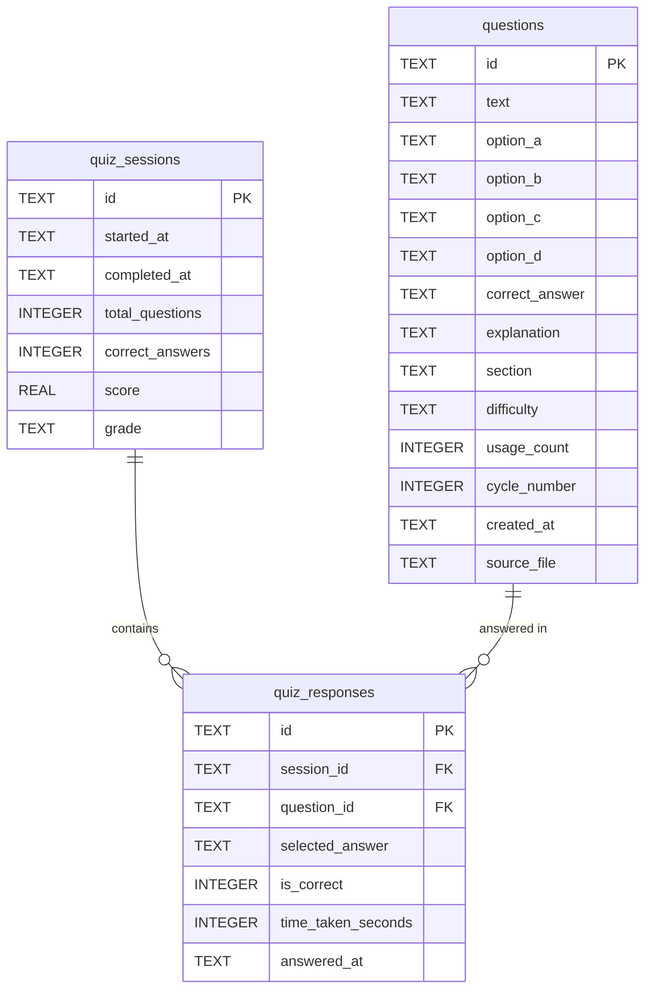
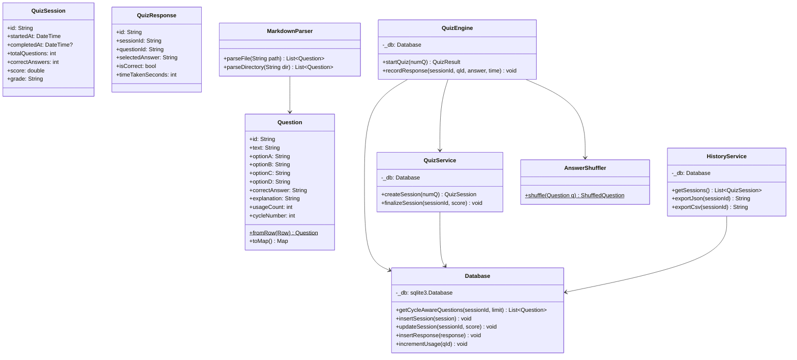

# Architecture — quiz-engine-dart

> Part of the [Quiz Engine multi-language collection](../README.md)

---

## System Overview

### 1000 ft View

A high-level picture of the Dart package structure and dependencies.

**Description:** Pure Dart app compiling to a native binary; `sqlite3` package provides synchronous SQLite access.

---

## Sequence Diagram

### Taking a Quiz Session

How the `quiz` command executes through Dart classes.

**Description:** Synchronous SQLite calls via the `sqlite3` package; Dart `List` and `Map` carry data between layers.

---

## ER Diagram

### Database Schema

SQLite tables created by `database.dart` on first run.

**Description:** Tables created with `CREATE TABLE IF NOT EXISTS`; IDs generated via `uuid` package as TEXT.

---

## Class Diagram

### Core Dart Classes

Key classes and their relationships across the `lib/src` directory tree.

**Description:** Dart uses factory constructors (`fromRow`) for model hydration; `Database` wraps all `sqlite3` calls.

---

## Data Flow Diagram

### Question Import and Quiz Flow

How data moves from Markdown files through the Dart package layers.

**Description:** All SQLite operations are synchronous; the Dart native binary has no external runtime dependency.
