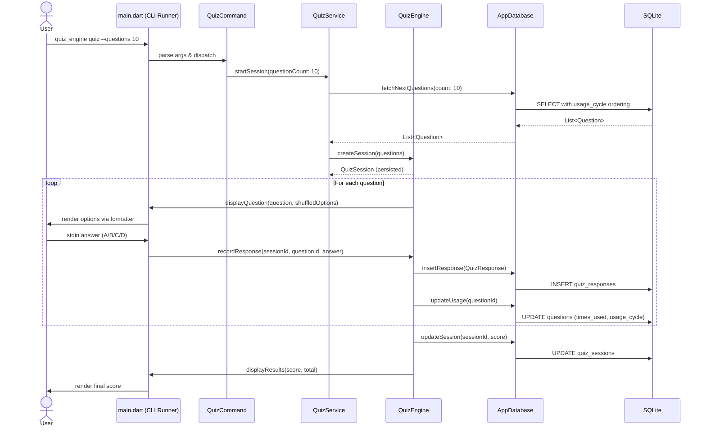
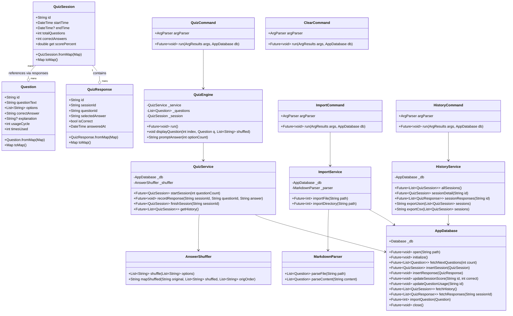
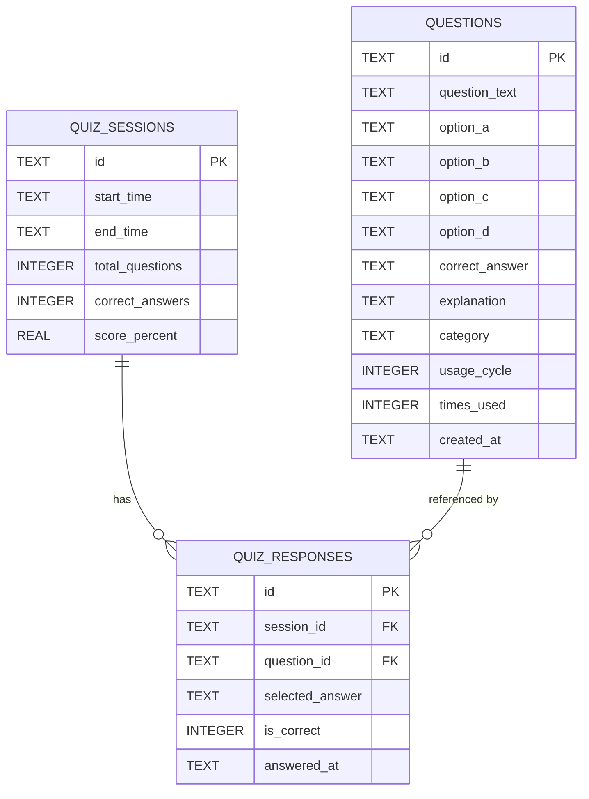
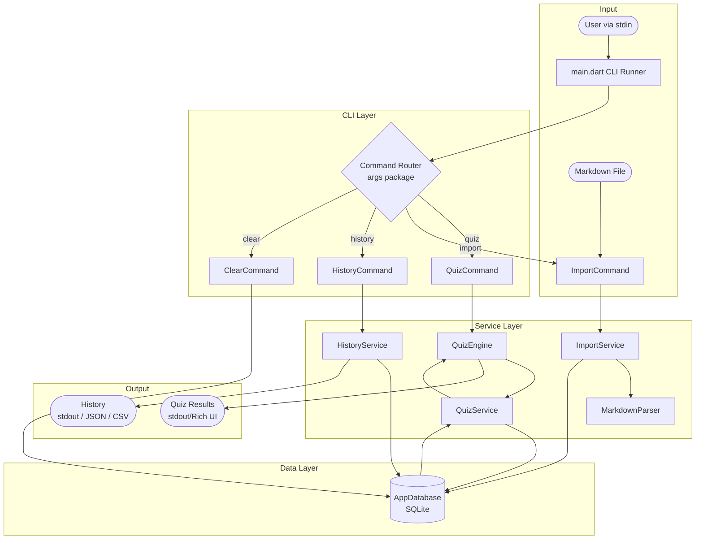

# Quiz Engine — Dart — Architecture

> See [README.md](README.md) for full setup and usage documentation.

- [Quiz Engine — Dart — Architecture](#quiz-engine--dart--architecture)
  - [Sequence Diagram — Quiz Command Flow](#sequence-diagram--quiz-command-flow)
  - [Class Diagram](#class-diagram)
  - [Entity Relationship Diagram](#entity-relationship-diagram)
  - [Data Flow Diagram](#data-flow-diagram)

---

## Sequence Diagram — Quiz Command Flow

---

## Class Diagram

---

## Entity Relationship Diagram

---

## Data Flow Diagram

