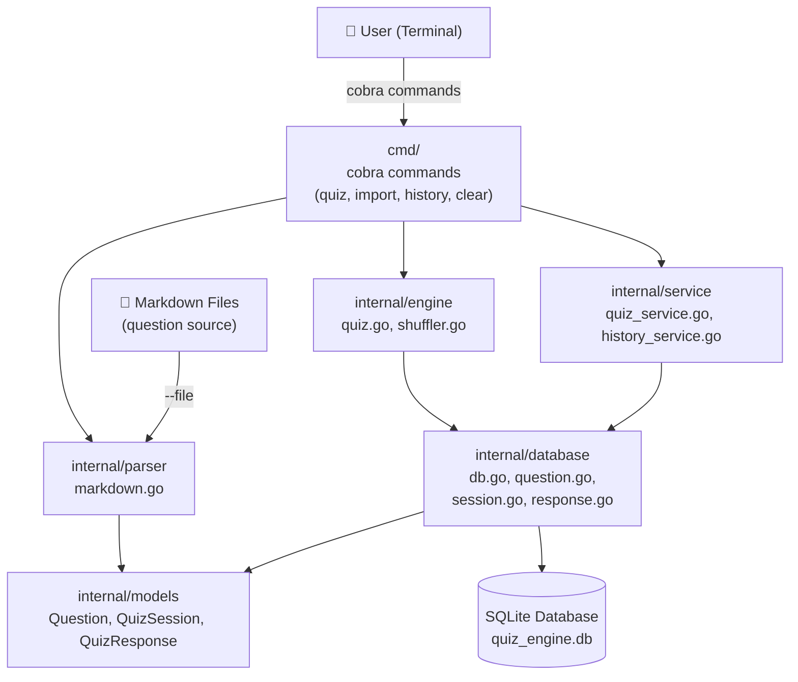
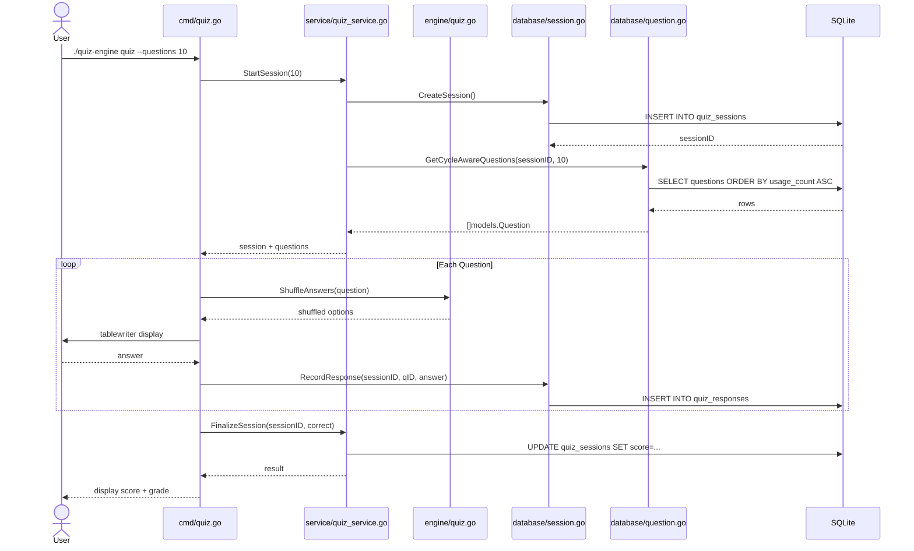
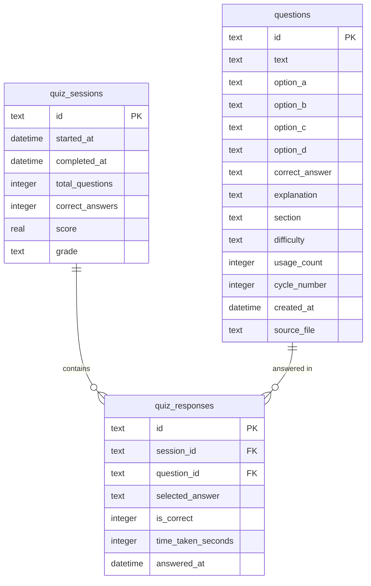
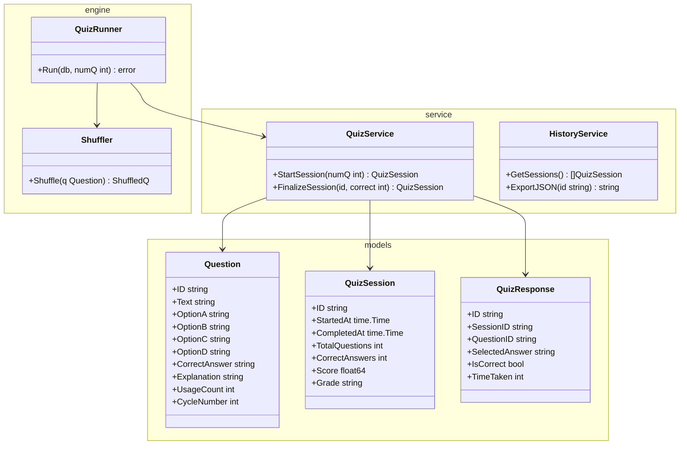

# Architecture — quiz-engine-golang

> Part of the [Quiz Engine multi-language collection](../README.md)

---

## System Overview

### 1000 ft View

A high-level picture of the Go application's packages and dependencies.

**Description:** Cobra commands delegate to engine/service packages; all persistence via `go-sqlite3`.

---

## Sequence Diagram

### Taking a Quiz Session

How the `quiz` command flows through the Go packages.

**Description:** All database calls go through `internal/database` package functions; cobra handles CLI parsing.

---

## ER Diagram

### Database Schema

The three SQLite tables managed by `internal/database`.

**Description:** Schema created with `CREATE TABLE IF NOT EXISTS` statements in `db.go`.

---

## Class Diagram

### Package Structure and Types

Go structs, interfaces, and their package relationships.

**Description:** Go uses struct composition over inheritance; packages enforce encapsulation via exported types.

---

## Data Flow Diagram

### Question Import and Quiz Flow

How data moves through `internal/` packages during import and quiz execution.

```mermaid
flowchart LR
    A["📄 Markdown File"] -->|"os.ReadFile"| B["parser/markdown.go\nParseFile()"]
    B -->|"[]models.Question"| C["cmd/import.go\nimportQuestions()"]
    C -->|"db.Exec INSERT"| D[("SQLite\nquestions table")]

    D -->|"SELECT cycle-aware"| E["database/question.go\nGetCycleAware()"]
    E -->|"[]Question"| F["engine/shuffler.go\nShuffle()"]
    F -->|"ShuffledQuestion"| G["cli/display.go\ntablewriter render"]
    G -->|"user answer"| H["database/response.go\nInsertResponse()"]
    H -->|"db.Exec INSERT"| I[("SQLite\nquiz_responses")]
    H -->|"db.Exec UPDATE"| D
    I -->|"COUNT / SUM"| J["service/quiz_service.go\nFinalizeSession()"]
    J -->|"score + grade"| K["cli/formatter.go\nPrint results"]
```

**Description:** `internal/parser` reads Markdown; all database writes use parameterized `database/sql` statements.
