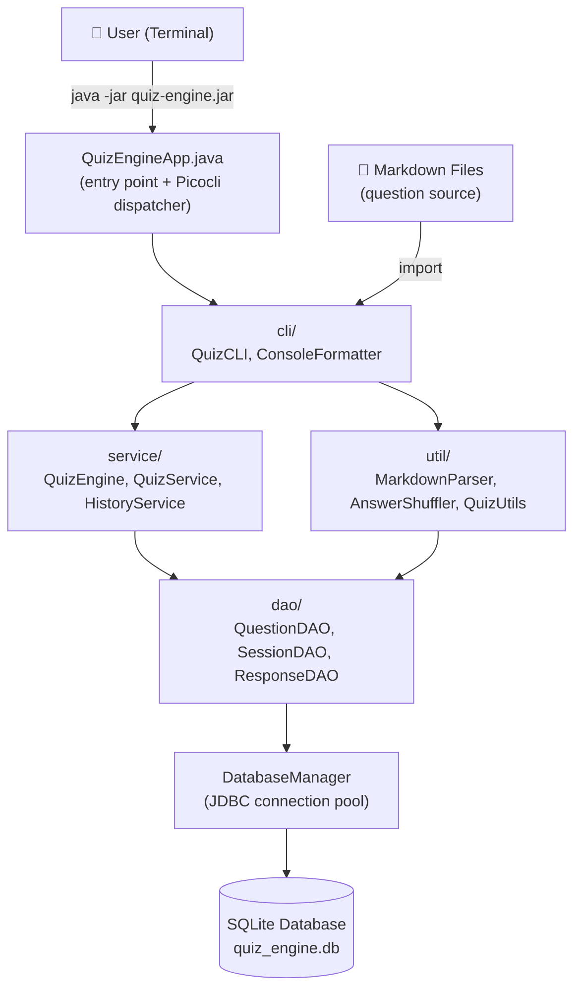
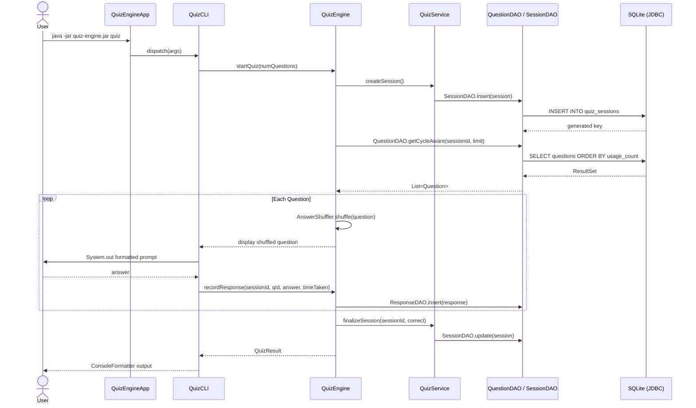
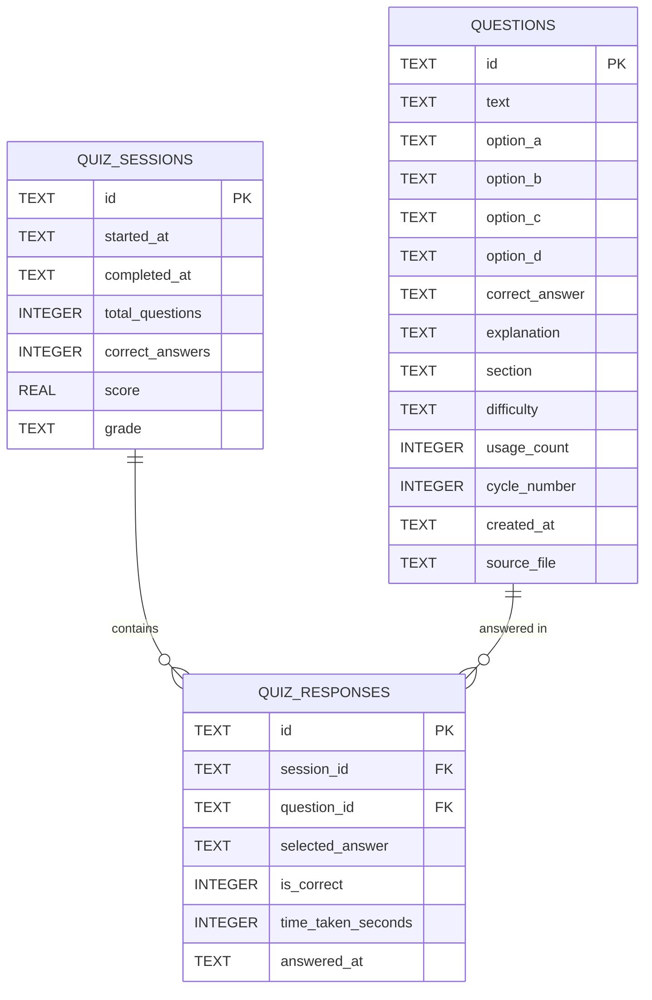
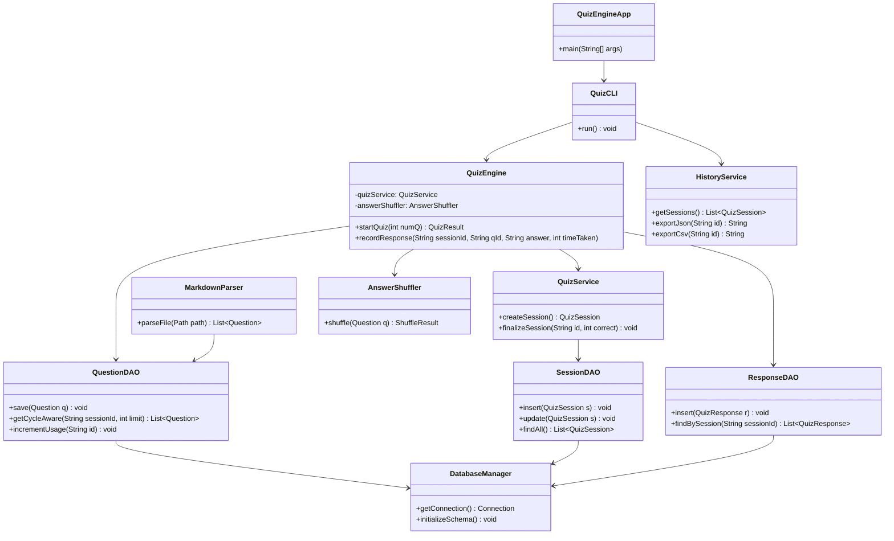

# Architecture — quiz-engine-java

> Part of the [Quiz Engine multi-language collection](../README.md)

---

## System Overview

### 1000 ft View

A high-level picture of the Maven project's layers and external dependencies.

**Description:** Plain Java with JDBC; no ORM — all SQL hand-written in DAO classes.

---

## Sequence Diagram

### Taking a Quiz Session

How a `quiz` command flows through the Java class hierarchy.

**Description:** Picocli dispatches commands to `QuizCLI`; all SQL executed via raw `PreparedStatement`.

---

## ER Diagram

### Database Schema

SQLite tables created by `DatabaseManager.initializeSchema()`.

**Description:** Schema initialised from `resources/schema.sql` on first run via `DatabaseManager`.

---

## Class Diagram

### Core Java Classes

Key classes and their relationships across the `com.quizengine` package tree.

**Description:** All DAO classes share a single `DatabaseManager` connection; no dependency injection framework used.

---

## Data Flow Diagram

### Question Import and Quiz Flow

How data moves through the Maven project's layers.

```mermaid
flowchart LR
    A["📄 Markdown File"] -->|"Files.readString"| B["MarkdownParser\nparseFile()"]
    B -->|"List<Question>"| C["ImportCommand\nCallable.call()"]
    C -->|"PreparedStatement INSERT"| D[("SQLite\nQUESTIONS table")]

    D -->|"SELECT cycle-aware"| E["QuestionDAO\ngetCycleAware()"]
    E -->|"List<Question>"| F["AnswerShuffler\nshuffle()"]
    F -->|"ShuffleResult"| G["ConsoleFormatter\ndisplayQuestion()"]
    G -->|"readLine answer"| H["QuizEngine\nrecordResponse()"]
    H -->|"PreparedStatement INSERT"| I[("SQLite\nQUIZ_RESPONSES table")]
    H -->|"PreparedStatement UPDATE"| D
    I -->|"COUNT correct"| J["QuizService\nfinalizeSession()"]
    J -->|"score + grade"| K["ConsoleFormatter\ndisplayResult()"]
```

**Description:** All SQL uses `PreparedStatement` for parameterized queries; `DatabaseManager` provides the `Connection`.
