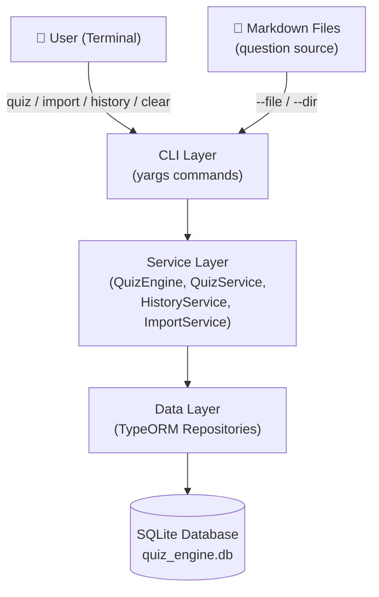
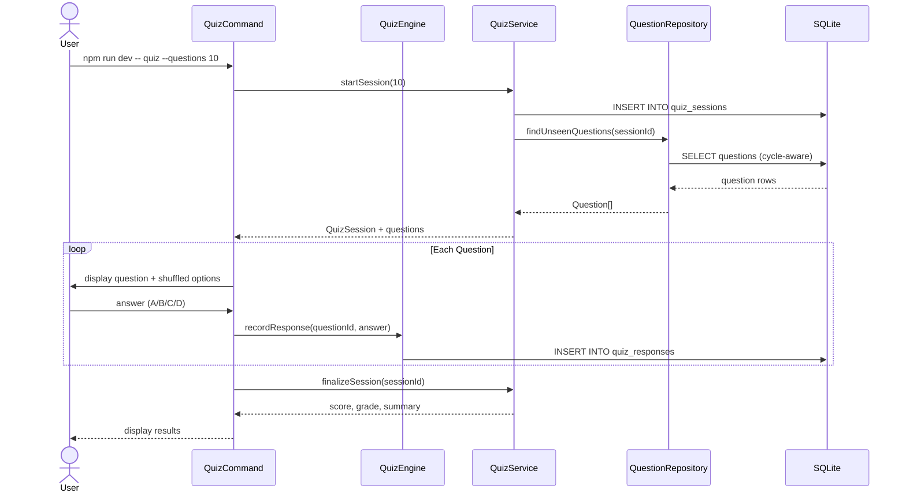
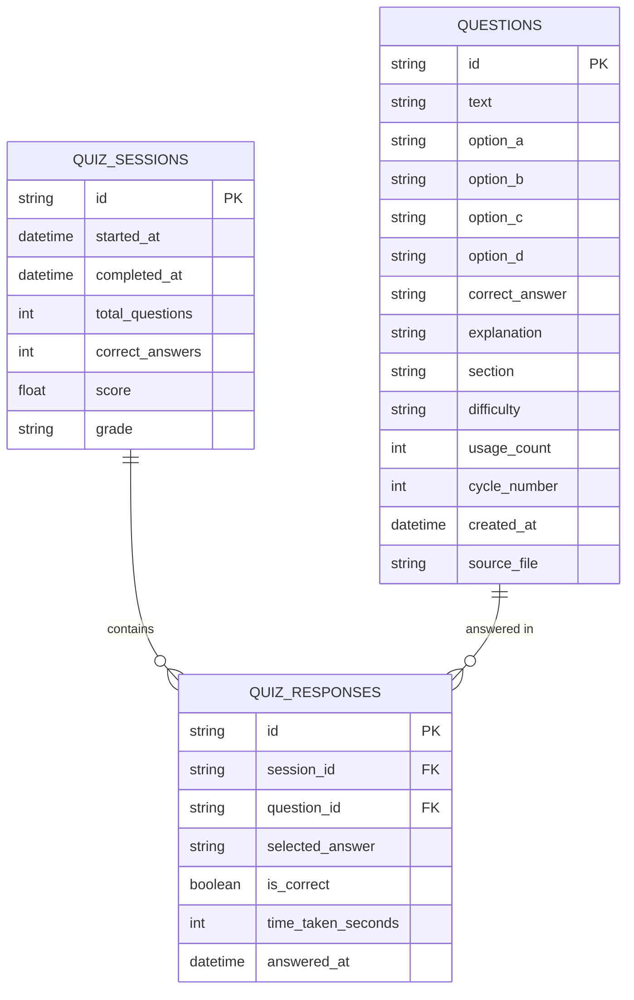
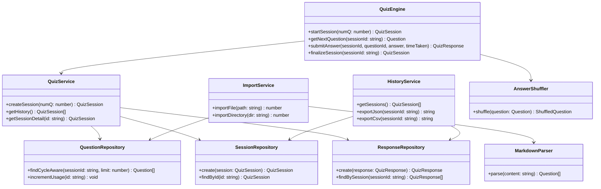

# Architecture — quiz-engine-nodejs

> Part of the [Quiz Engine multi-language collection](../README.md)

---

## System Overview

### 1000 ft View

A high-level picture of the system's components and external dependencies.

**Description:** User commands flow through the CLI to service logic, persisted via TypeORM into SQLite.

---

## Sequence Diagram

### Taking a Quiz Session

How a `quiz` command executes from start to finish.

**Description:** Session creation, cycle-aware question selection, response recording, and final score display.

---

## ER Diagram

### Database Schema

The three SQLite tables and their relationships.

**Description:** Each session has many responses; each response links to one question.

---

## Class Diagram

### Core TypeScript Classes and Interfaces

Key classes, interfaces, and their relationships in the service and data layers.

**Description:** Service layer orchestrates repositories; `AnswerShuffler` and `MarkdownParser` are pure utilities.

---

## Data Flow Diagram

### Question Import and Quiz Flow

How data moves from a Markdown file through import to a completed quiz session.

```mermaid
flowchart LR
    A["📄 Markdown File"] -->|"read"| B["MarkdownParser\nparse()"]
    B -->|"Question[]"| C["ImportService\nimportFile()"]
    C -->|"INSERT"| D[("SQLite\nquestions table")]

    D -->|"SELECT cycle-aware"| E["QuestionRepository\nfindCycleAware()"]
    E -->|"Question[]"| F["AnswerShuffler\nshuffle()"]
    F -->|"shuffled options"| G["QuizCommand\ndisplay"]
    G -->|"user answer"| H["QuizEngine\nsubmitAnswer()"]
    H -->|"INSERT response"| I[("SQLite\nquiz_responses")]
    H -->|"UPDATE usage_count"| D
    I -->|"aggregate"| J["QuizService\nfinalizeSession()"]
    J -->|"score + grade"| K["ConsoleFormatter\ndisplay results"]
```

**Description:** Markdown is parsed on import; questions flow through shuffling, user interaction, and persistence on each quiz run.
