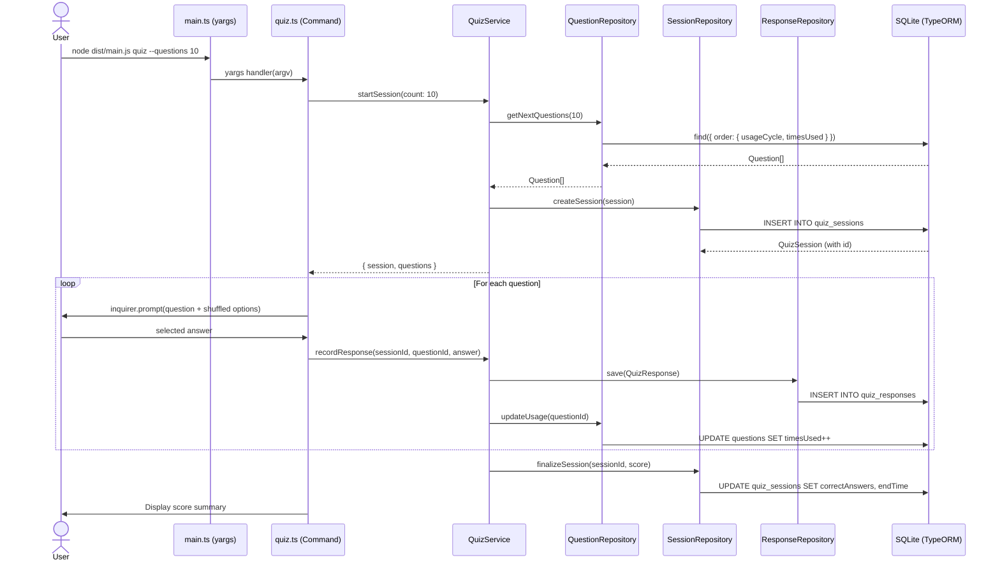
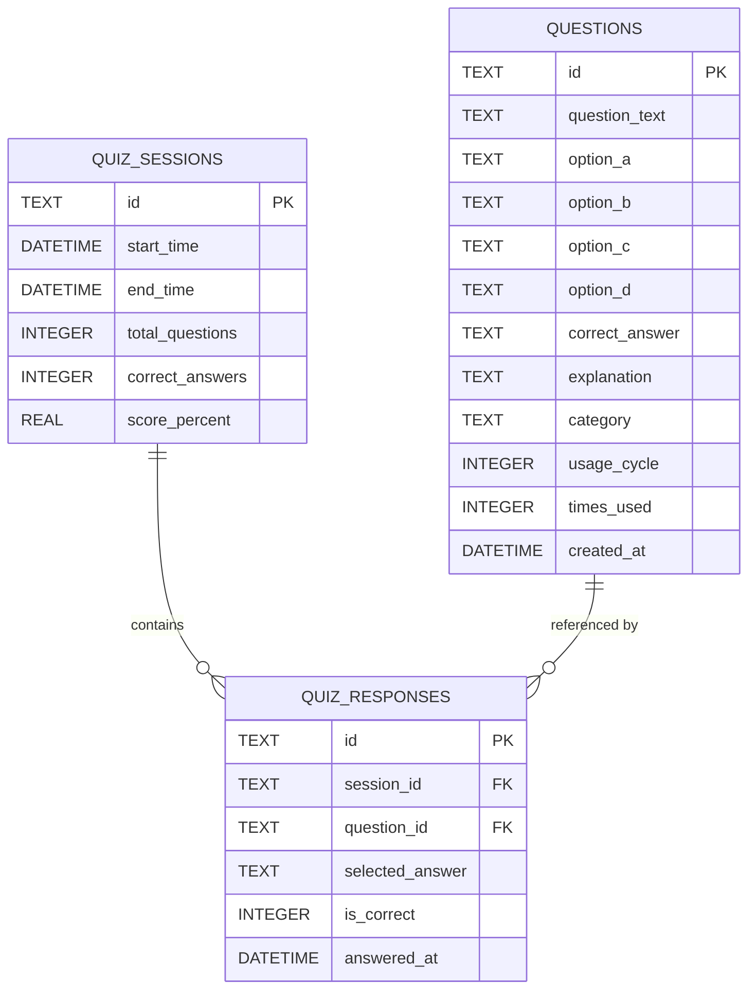
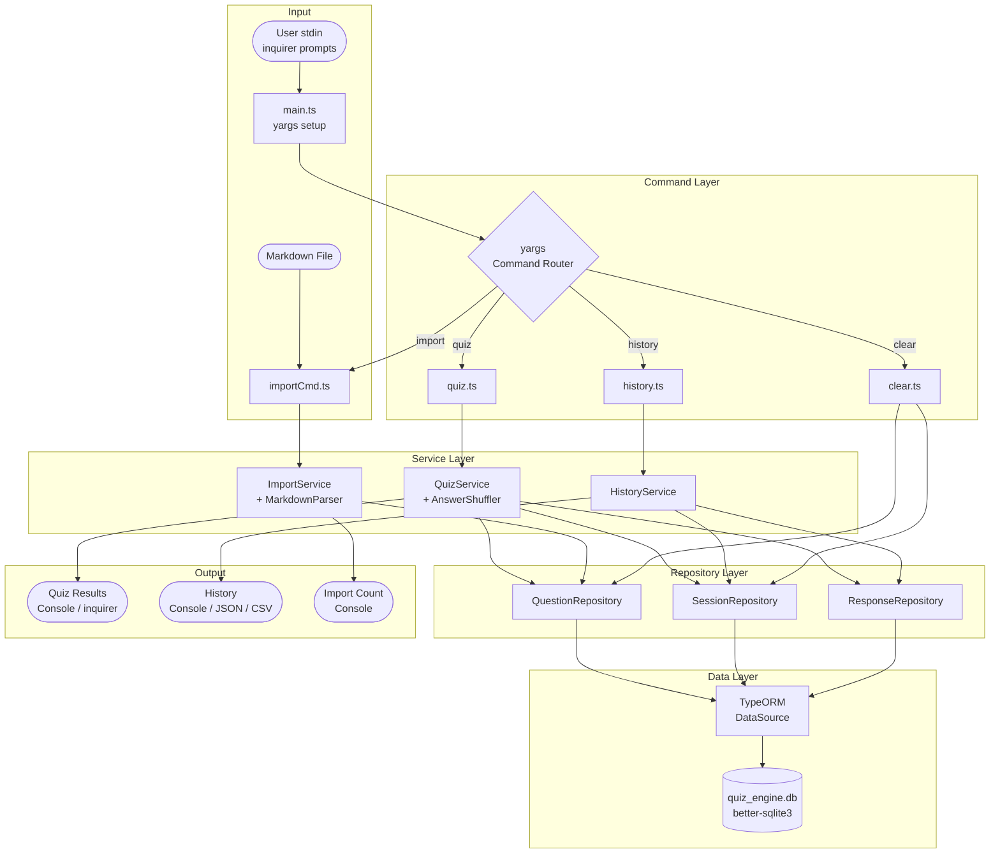

# Quiz Engine — Node.js — Architecture

> See [README.md](README.md) for full setup and usage documentation.

- [Quiz Engine — Node.js — Architecture](#quiz-engine--nodejs--architecture)
  - [Sequence Diagram — Quiz Command Flow](#sequence-diagram--quiz-command-flow)
  - [Class Diagram](#class-diagram)
  - [Entity Relationship Diagram](#entity-relationship-diagram)
  - [Data Flow Diagram](#data-flow-diagram)

---

## Sequence Diagram — Quiz Command Flow

---

## Class Diagram

```mermaid
classDiagram
    class Question {
        <<Entity>>
        +string id
        +string questionText
        +string optionA
        +string optionB
        +string optionC
        +string optionD
        +string correctAnswer
        +string explanation
        +string category
        +number usageCycle
        +number timesUsed
        +Date createdAt
    }

    class QuizSession {
        <<Entity>>
        +string id
        +Date startTime
        +Date endTime
        +number totalQuestions
        +number correctAnswers
        +number scorePercent
        +QuizResponse[] responses
    }

    class QuizResponse {
        <<Entity>>
        +string id
        +string sessionId
        +string questionId
        +string selectedAnswer
        +boolean isCorrect
        +Date answeredAt
    }

    class QuestionRepository {
        <<TypeORM Repository>>
        +getNextQuestions(count: number) Promise~Question[]~
        +updateUsage(id: string) Promise~void~
        +importQuestion(q: Partial~Question~) Promise~Question~
        +deleteAll() Promise~void~
    }

    class SessionRepository {
        <<TypeORM Repository>>
        +createSession(s: Partial~QuizSession~) Promise~QuizSession~
        +finalizeSession(id: string, correct: number) Promise~void~
        +getAllSessions() Promise~QuizSession[]~
        +getSession(id: string) Promise~QuizSession | null~
    }

    class ResponseRepository {
        <<TypeORM Repository>>
        +saveResponse(r: Partial~QuizResponse~) Promise~QuizResponse~
        +getBySession(sessionId: string) Promise~QuizResponse[]~
    }

    class QuizService {
        -questionRepo: QuestionRepository
        -sessionRepo: SessionRepository
        -responseRepo: ResponseRepository
        -shuffler: AnswerShuffler
        +startSession(count: number) Promise~SessionStart~
        +recordResponse(sessionId, qId, answer) Promise~boolean~
        +finishSession(sessionId: string) Promise~QuizSession~
    }

    class ImportService {
        -questionRepo: QuestionRepository
        -parser: MarkdownParser
        +importFile(path: string) Promise~number~
        +importDirectory(path: string) Promise~number~
    }

    class HistoryService {
        -sessionRepo: SessionRepository
        -responseRepo: ResponseRepository
        +getSessions() Promise~QuizSession[]~
        +getDetail(id: string) Promise~SessionDetail~
        +exportJson(sessions: QuizSession[]) string
        +exportCsv(sessions: QuizSession[]) string
    }

    class MarkdownParser {
        +parseFile(path: string) Promise~Question[]~
        +parseContent(content: string) Question[]
    }

    class AnswerShuffler {
        +shuffle(options: string[]) string[]
        +mapAnswer(original, shuffled, origOrder) string
    }

    class QuizExceptions {
        <<namespace>>
        +NoDatabaseError
        +NoQuestionsError
        +SessionNotFoundError
        +ImportError
    }

    QuizService --> QuestionRepository
    QuizService --> SessionRepository
    QuizService --> ResponseRepository
    QuizService --> AnswerShuffler
    ImportService --> QuestionRepository
    ImportService --> MarkdownParser
    HistoryService --> SessionRepository
    HistoryService --> ResponseRepository
    QuizSession "1" --o "many" QuizResponse
    Question "1" --o "many" QuizResponse
```

---

## Entity Relationship Diagram

---

## Data Flow Diagram

