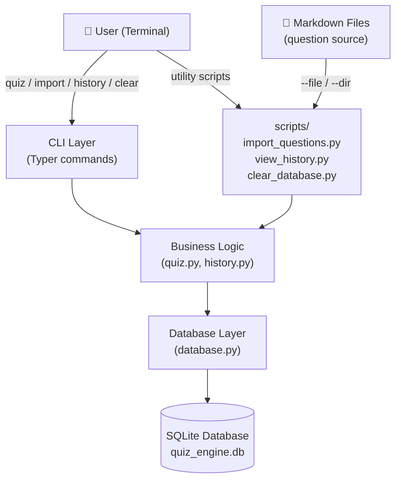
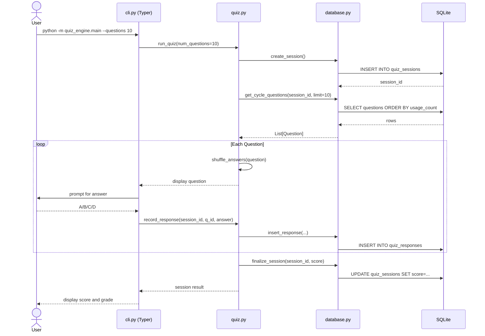
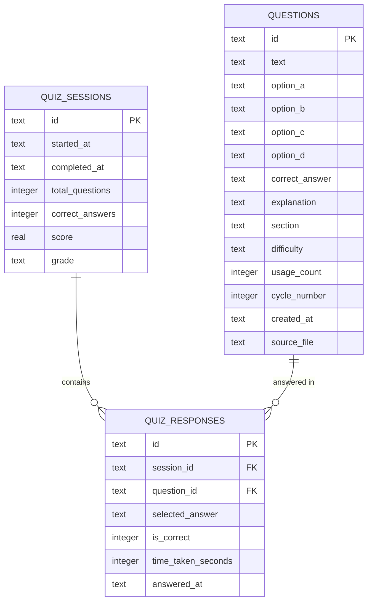
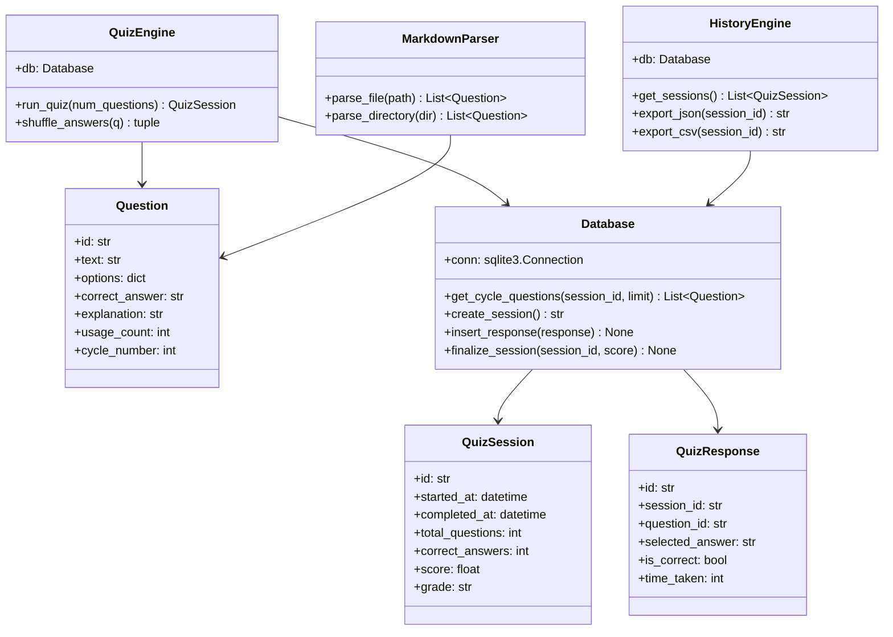

# Architecture — quiz-engine-python

> Part of the [Quiz Engine multi-language collection](../README.md)

---

## System Overview

### 1000 ft View

A high-level picture of the system's components and external dependencies.

**Description:** Typer CLI delegates to business logic modules; all state persisted in a local SQLite file.

---

## Sequence Diagram

### Taking a Quiz Session

How a `quiz` command executes from start to finish.

**Description:** Session lifecycle managed by `quiz.py`; `database.py` wraps all SQLite interactions.

---

## ER Diagram

### Database Schema

The three SQLite tables and their relationships.

**Description:** Three normalized tables; responses join sessions to questions.

---

## Class Diagram

### Core Python Classes and Modules

Key classes and their relationships across the `quiz_engine` package.

**Description:** Pydantic-based models flow through a lightweight service and database module structure.

---

## Data Flow Diagram

### Question Import and Quiz Flow

How data moves from Markdown source files through the system.

**Description:** Import populates questions once; the quiz loop reads, shuffles, records, and finalizes each session.
