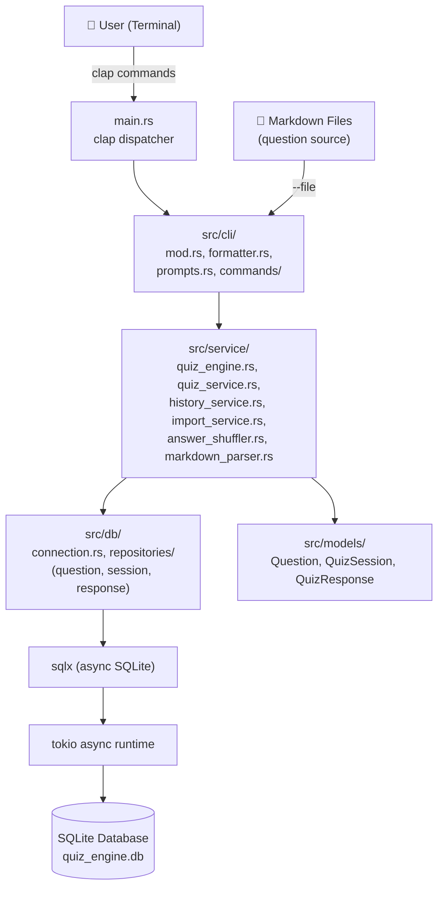
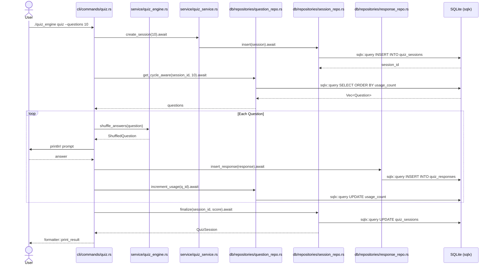
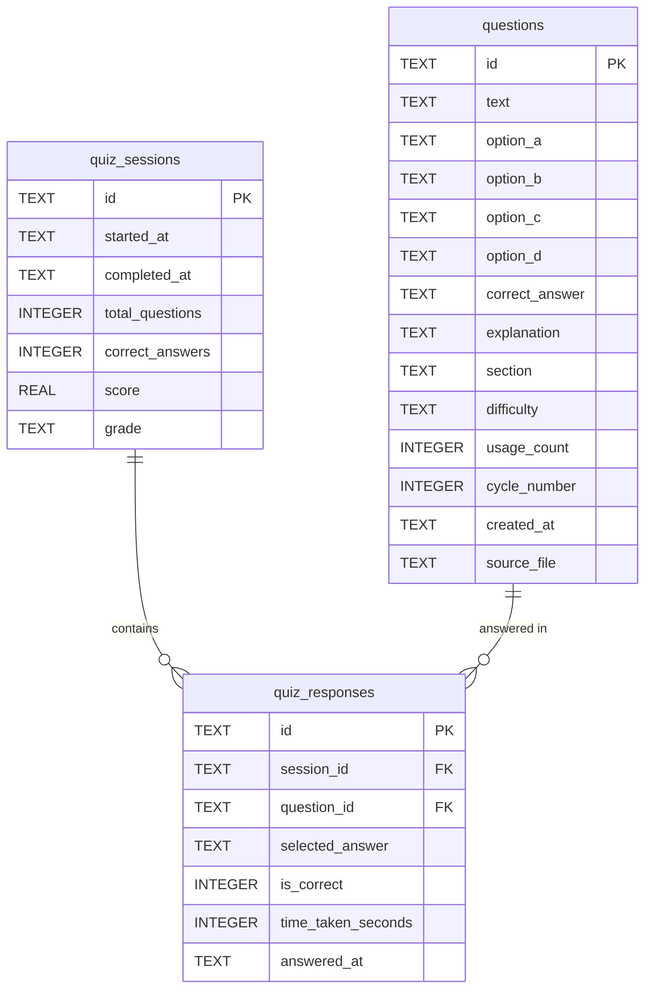
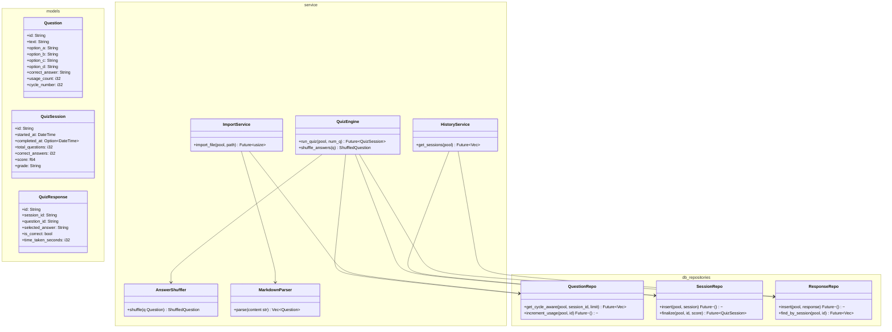

# Architecture — quiz-engine-rust

> Part of the [Quiz Engine multi-language collection](../README.md)

---

## System Overview

### 1000 ft View

A high-level picture of the Rust crate's modules and async runtime.

**Description:** Fully async via tokio; sqlx provides compile-time-checked queries against SQLite.

---

## Sequence Diagram

### Taking a Quiz Session

The async request flow from `quiz` command through tokio to SQLite.

**Description:** All database calls are `async fn`; the tokio runtime drives the entire execution graph.

---

## ER Diagram

### Database Schema

SQLite tables created by migrations in `migrations/001_create_tables.sql`.

**Description:** Migrations applied via `sqlx::migrate!` macro at startup; UUIDs are stored as TEXT.

---

## Class Diagram

### Core Rust Structs and Traits

Key structs, traits, and their module relationships.

**Description:** Rust uses trait objects and `sqlx::Pool` passed by reference; no global state.

---

## Data Flow Diagram

### Question Import and Quiz Flow

How data flows through async functions across Rust modules.

```mermaid
flowchart LR
    A["📄 Markdown File"] -->|"fs::read_to_string.await"| B["MarkdownParser\nparse()"]
    B -->|"Vec<Question>"| C["ImportService\nimport_file().await"]
    C -->|"sqlx INSERT batch"| D[("SQLite\nquestions table")]

    D -->|"sqlx SELECT cycle-aware"| E["QuestionRepo\nget_cycle_aware().await"]
    E -->|"Vec<Question>"| F["AnswerShuffler\nshuffle()"]
    F -->|"ShuffledQuestion"| G["cli/prompts.rs\nprompt user"]
    G -->|"user answer"| H["ResponseRepo\ninsert().await"]
    H -->|"sqlx INSERT"| I[("SQLite\nquiz_responses")]
    H -->|"sqlx UPDATE"| D
    I -->|"aggregate"| J["SessionRepo\nfinalize().await"]
    J -->|"score + grade"| K["cli/formatter.rs\nprint results"]
```

**Description:** All I/O is non-blocking; `sqlx` macro-checks SQL at compile time against the database schema.
