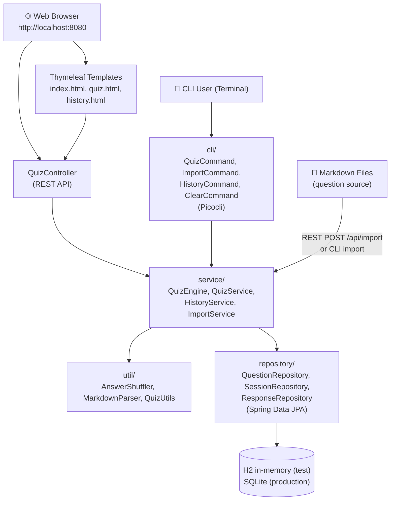
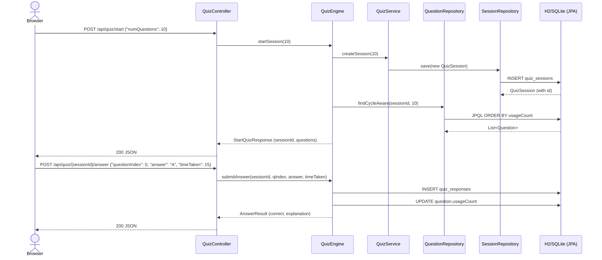
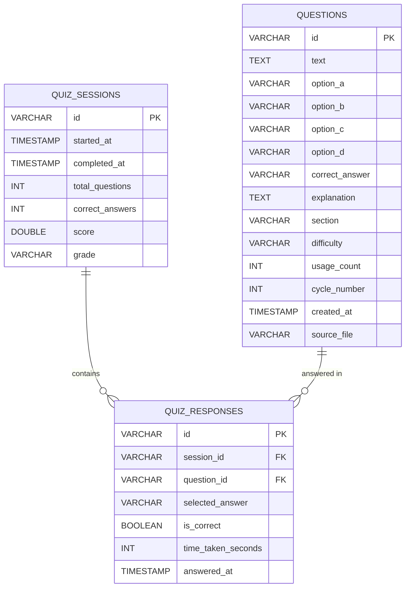
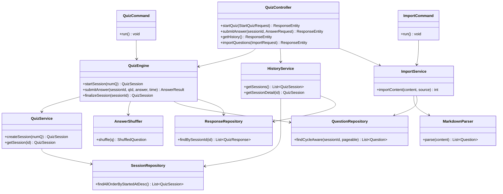

# Architecture — quiz-engine-springboot

> Part of the [Quiz Engine multi-language collection](../README.md)

---

## System Overview

### 1000 ft View

A high-level picture of the Spring Boot application with both web and CLI interfaces.

**Description:** Spring Boot exposes REST + Thymeleaf web UI alongside a Picocli CLI backed by Spring Data JPA.

---

## Sequence Diagram

### Web Quiz Flow (REST API)

A browser-based quiz session from start to answer submission.

**Description:** REST endpoints delegate to service beans; JPA manages transaction boundaries.

---

## ER Diagram

### Database Schema

JPA entities mapped to H2 (test) and SQLite (production) by Spring Data.

**Description:** JPA `@Entity` annotations drive DDL auto-generation; `@OneToMany` navigates session to responses.

---

## Class Diagram

### Core Spring Boot Classes

Key beans and their dependency injection relationships.

**Description:** All beans managed by Spring IoC; `@Transactional` on service methods ensures consistency.

---

## Data Flow Diagram

### Question Import and Quiz Flow (Web)

How data flows through the Spring layers during import and a web quiz session.

```mermaid
flowchart LR
    A["📄 Markdown Content\n(POST body or file)"] -->|"importContent()"| B["MarkdownParser\nparse()"]
    B -->|"List<Question>"| C["ImportService\nimportContent()"]
    C -->|"JPA saveAll()"| D[("H2 / SQLite\nQUESTIONS table")]

    D -->|"JPQL cycle-aware"| E["QuestionRepository\nfindCycleAware()"]
    E -->|"List<Question>"| F["AnswerShuffler\nshuffle()"]
    F -->|"ShuffledQuestion[]"| G["QuizController\nStartQuizResponse JSON"]
    G -->|"browser answer"| H["QuizEngine\nsubmitAnswer()"]
    H -->|"JPA save()"| I[("H2 / SQLite\nQUIZ_RESPONSES")]
    H -->|"JPA save() usageCount++"| D
    I -->|"JPA aggregate"| J["QuizService\nfinalizeSession()"]
    J -->|"score + grade JSON"| K["Thymeleaf / REST\nrender result"]
```

**Description:** Spring Data JPA repositories abstract all SQL; Thymeleaf renders server-side HTML for the web UI.
