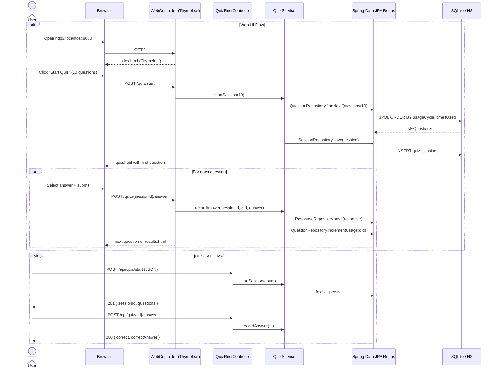
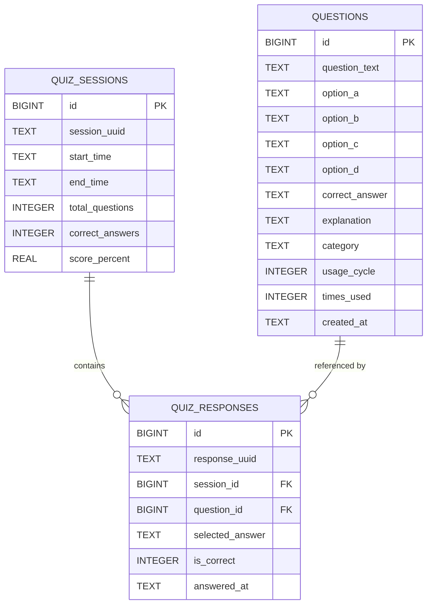
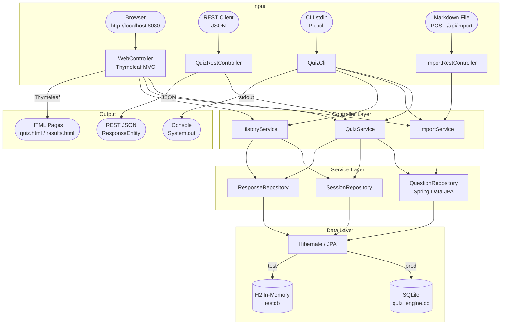

# Quiz Engine — Spring Boot — Architecture

> See [README.md](README.md) for full setup and usage documentation.

- [Quiz Engine — Spring Boot — Architecture](#quiz-engine--spring-boot--architecture)
  - [Sequence Diagram — Quiz Flow (Web + REST)](#sequence-diagram--quiz-flow-web--rest)
  - [Class Diagram](#class-diagram)
  - [Entity Relationship Diagram](#entity-relationship-diagram)
  - [Data Flow Diagram](#data-flow-diagram)

---

## Sequence Diagram — Quiz Flow (Web + REST)

---

## Class Diagram

```mermaid
classDiagram
    class Question {
        <<Entity>>
        +Long id
        +String questionText
        +String optionA
        +String optionB
        +String optionC
        +String optionD
        +String correctAnswer
        +String explanation
        +String category
        +int usageCycle
        +int timesUsed
        +LocalDateTime createdAt
        +getters() / setters()
    }

    class QuizSession {
        <<Entity>>
        +Long id
        +String sessionUuid
        +LocalDateTime startTime
        +LocalDateTime endTime
        +int totalQuestions
        +int correctAnswers
        +double getScorePercent()
        +List~QuizResponse~ responses
    }

    class QuizResponse {
        <<Entity>>
        +Long id
        +String responseUuid
        +QuizSession session
        +Question question
        +String selectedAnswer
        +boolean isCorrect
        +LocalDateTime answeredAt
    }

    class QuestionRepository {
        <<JpaRepository>>
        +findNextQuestions(int count) List~Question~
        +incrementUsage(Long id) void
        +deleteAllQuestions() void
    }

    class SessionRepository {
        <<JpaRepository>>
        +findBySessionUuid(String uuid) Optional~QuizSession~
        +findAllByOrderByStartTimeDesc() List~QuizSession~
    }

    class ResponseRepository {
        <<JpaRepository>>
        +findBySessionUuid(String uuid) List~QuizResponse~
    }

    class QuizService {
        -QuestionRepository questionRepo
        -SessionRepository sessionRepo
        -ResponseRepository responseRepo
        -AnswerShuffler shuffler
        +startSession(int count) SessionStartResult
        +recordAnswer(String sessionId, Long qId, String ans) AnswerResult
        +finishSession(String sessionId) QuizSession
    }

    class ImportService {
        -QuestionRepository questionRepo
        -MarkdownParser parser
        +importFile(String path) int
        +importDirectory(String path) int
    }

    class HistoryService {
        -SessionRepository sessionRepo
        -ResponseRepository responseRepo
        +getAllSessions() List~QuizSession~
        +getDetail(String uuid) SessionDetail
        +exportJson(List~QuizSession~) String
        +exportCsv(List~QuizSession~) String
    }

    class WebController {
        <<Controller>>
        -QuizService quizService
        -ImportService importService
        -HistoryService historyService
        +index(Model) String
        +startQuiz(int count, Model) String
        +showQuestion(String sessionId, int idx, Model) String
        +submitAnswer(String sessionId, AnswerForm, Model) String
        +results(String sessionId, Model) String
        +history(Model) String
    }

    class QuizRestController {
        <<RestController>>
        -QuizService quizService
        +startSession(StartRequest) ResponseEntity
        +submitAnswer(String id, AnswerRequest) ResponseEntity
        +finishSession(String id) ResponseEntity
        +getHistory() ResponseEntity
    }

    class ImportRestController {
        <<RestController>>
        -ImportService importService
        +importFile(MultipartFile) ResponseEntity
    }

    class QuizCli {
        <<Command Picocli>>
        -QuizService quizService
        -ImportService importService
        -HistoryService historyService
        +quiz(int questions)
        +importCmd(String file, String dir)
        +history(String sessionId)
        +clear(boolean confirm)
    }

    QuizService --> QuestionRepository
    QuizService --> SessionRepository
    QuizService --> ResponseRepository
    QuizService --> AnswerShuffler
    ImportService --> QuestionRepository
    HistoryService --> SessionRepository
    HistoryService --> ResponseRepository
    WebController --> QuizService
    WebController --> ImportService
    WebController --> HistoryService
    QuizRestController --> QuizService
    ImportRestController --> ImportService
    QuizCli --> QuizService
    QuizCli --> ImportService
    QuizCli --> HistoryService
    QuizSession "1" --o "many" QuizResponse
    Question "1" --o "many" QuizResponse
```

---

## Entity Relationship Diagram

---

## Data Flow Diagram

